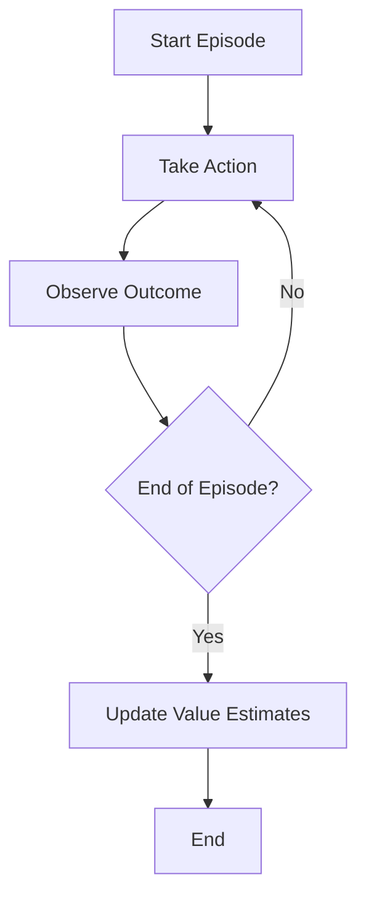
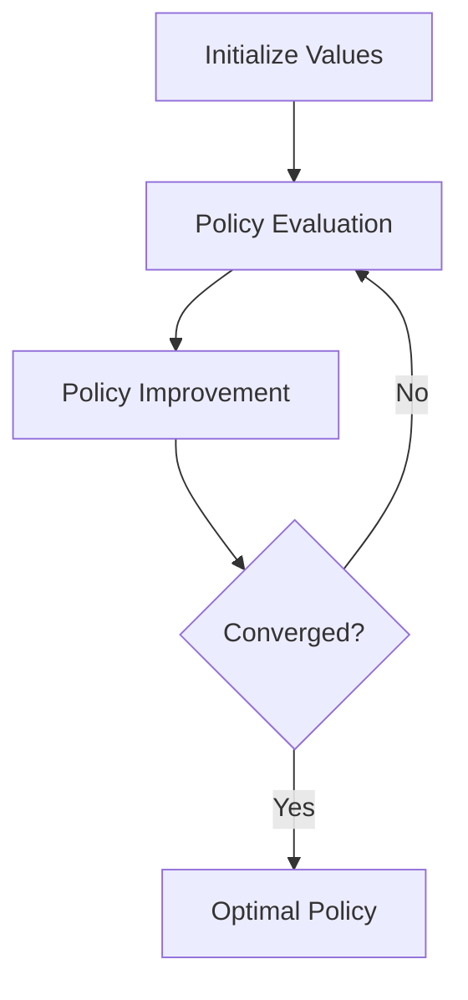

## Model-Free Approaches in Reinforcement Learning

Model-free approaches in reinforcement learning learn by doing, like learning to ride a bike through practice rather than studying physics textbooks. They don't need a manual of how things work - they figure it out through trial and error.

### Monte Carlo Methods

Think of Monte Carlo methods like learning from complete games:
- Example: A robot learning to play chess by playing full games and remembering which moves led to wins
- Only updates what it learned after the game is finished
- Works well for games with clear endings
- Simple but needs to wait for complete episodes

Key point: Must finish the entire experience before learning from it

### Temporal Difference Methods

TD methods learn as they go, like how a cat doesn't wait until it catches the mouse to adjust its chase strategy:
- Example: A self-driving car adjusting its steering continuously based on how far it is from the lane center
- Updates learning in real-time
- More efficient because it learns from each step
- Combines immediate feedback with future predictions

Key difference from Monte Carlo: Can learn from incomplete experiences

### Monte Carlo Tree Search

Monte Carlo Tree Search (MCTS) is like planning several moves ahead in a game of chess by simulating many possible future scenarios:
- Example: A computer program playing Go, exploring different sequences of moves to find the most promising one
- Balances exploration (trying new moves) and exploitation (using known good moves)
- Builds a search tree where each node represents a game state
- Uses random sampling to simulate outcomes and improve the tree

Key point: Combines random sampling with strategic planning to make decisions

### Monte Carlo Tree Search vs Regular Monte Carlo

While both Monte Carlo Tree Search (MCTS) and regular Monte Carlo methods use random sampling to make decisions, they differ significantly in their approach and application:

- **Monte Carlo Methods**:
    - Learn from complete episodes or experiences.
    - Suitable for problems with clear and finite episodes.
    - Example: Learning to play a game by playing full matches and updating strategies based on the outcomes.

- **Monte Carlo Tree Search (MCTS)**:
    - Focuses on decision-making by simulating many possible future scenarios.
    - Builds a search tree to explore different sequences of actions.
    - Balances exploration (trying new actions) and exploitation (using known good actions).
    - Example: A computer program playing Go, simulating various move sequences to determine the best strategy.

Key difference: Regular Monte Carlo methods learn from entire episodes after they are completed, while MCTS uses simulations to make decisions in real-time by planning several steps ahead.

### Partially Observable Markov Decision Processes (POMDPs)

POMDPs are like trying to navigate a foggy forest with a map that only shows part of the terrain:
- Example: A robot trying to find its way in a building where it can only see a few feet ahead
- The robot must make decisions based on incomplete and uncertain information
- Balances immediate rewards with long-term goals despite the uncertainty

Key point: POMDPs handle situations where the agent doesn't have a full view of the environment, making decisions based on probabilities and partial observations.

### Every-Visit Monte Carlo

Every-Visit Monte Carlo is a method where the value of a state is updated every time the state is visited within an episode, rather than just the first time it is visited.

#### Example

Imagine a robot learning to navigate a maze:
- The robot starts at the entrance and moves through the maze until it reaches the exit.
- Every time the robot visits a state (a position in the maze), it records the reward received.
- At the end of the episode, the robot updates the value of each state based on the average reward received from all visits to that state.

#### Comparison to Other Methods

- **First-Visit Monte Carlo**:
    - Updates the value of a state only the first time it is visited in an episode.
    - Example: If the robot visits a state multiple times in one run, only the first visit is used for updating the value.

- **Every-Visit Monte Carlo**:
    - Updates the value of a state every time it is visited in an episode.
    - Example: If the robot visits a state multiple times, each visit contributes to the value update.

- **Temporal Difference (TD) Methods**:
    - Update the value of a state based on the next state's value, without waiting for the episode to finish.
    - Example: The robot updates its value estimates continuously as it moves through the maze.

Key difference: Every-Visit Monte Carlo updates state values based on all visits within an episode, providing a more comprehensive learning experience compared to First-Visit Monte Carlo, while TD methods update values in real-time without waiting for the episode to end.
### Diagram Explanation: Every-Visit Monte Carlo Process

The following diagram illustrates the Every-Visit Monte Carlo process:

1. **Start Episode**: The process begins with the start of an episode.
2. **Take Action**: The agent takes an action based on its current policy.
3. **Observe Outcome**: The agent observes the outcome of the action, including the reward received and the new state.
4. **End of Episode?**: The agent checks if the episode has ended.
    - **Yes**: If the episode has ended, the agent proceeds to update the value estimates for all states visited during the episode.
    - **No**: If the episode has not ended, the agent takes another action and continues the process.
5. **Update Value Estimates**: At the end of the episode, the agent updates the value estimates for each state based on the average reward received from all visits to that state during the episode.
6. **End**: The process concludes, and the agent is ready to start a new episode.

This diagram highlights the iterative nature of the Every-Visit Monte Carlo method, where the agent learns from the entire episode and updates its value estimates accordingly.

### Diagram Explanation: Bellman Equation Process

The following diagram illustrates the Bellman Equation process:

1. **Initialize Values**: The process begins with initializing the value function for all states.
2. **Policy Evaluation**: The agent evaluates the current policy by updating the value function based on the Bellman equation.
3. **Policy Improvement**: The agent improves the policy by making it greedy with respect to the updated value function.
4. **Converged?**: The agent checks if the policy has converged.
    - **Yes**: If the policy has converged, the agent has found the optimal policy.
    - **No**: If the policy has not converged, the agent returns to the policy evaluation step and continues the process.
5. **Optimal Policy**: The process concludes with the agent having found the optimal policy.

This diagram highlights the iterative nature of the Bellman Equation process, where the agent alternates between policy evaluation and policy improvement until convergence is achieved.